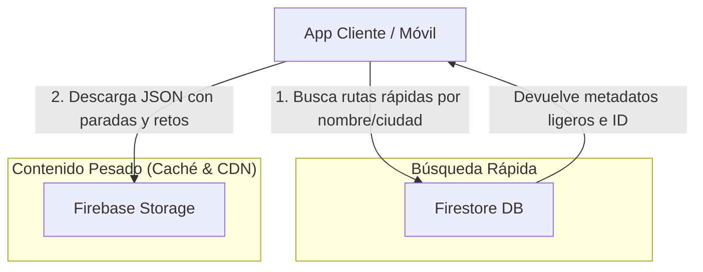
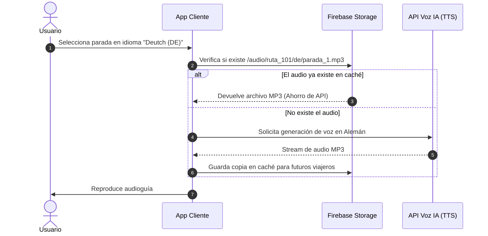

# Case Study: Arquitectura Híbrida y Escalable para App de Rutas Turísticas Multiidioma

> [!IMPORTANT]
> **Nota Legal y de Confidencialidad:**  
> Este documento es un estudio de caso arquitectónico de un sistema desarrollado durante un periodo de prácticas profesionales. La propiedad intelectual, el código de producción y las bases de datos pertenecen exclusivamente a la empresa propietaria. Por motivos de seguridad y privacidad, no se exponen endpoints, credenciales ni claves privadas. El objetivo de este documento es ilustrar las decisiones de ingeniería, optimización de costes y soluciones técnicas implementadas.

---

## Resumen Ejecutivo

Durante el desarrollo de la aplicación de rutas turísticas auditivas, surgió un reto crítico de escalabilidad y costes en la nube: las lecturas masivas en base de datos al cargar rutas con múltiples paradas, audios y textos en distintos idiomas disparaban la latencia y los costes operativos.

**Solución Implementada:** Se diseñó una **Arquitectura Híbrida** que separa la indexación ligera (en Firestore) del almacenamiento de contenido pesado (en Firebase Storage mediante JSONs localizados), reduciendo drásticamente los costes de lectura y mejorando la velocidad de carga en dispositivos móviles.

---

## 1. Arquitectura de Datos Híbrida: Firestore + Firebase Storage

### El Problema Anterior
Almacenar descripciones extensas, coordenadas GPS de docenas de paradas, retos y metadatos multiidioma directamente en documentos y subcolecciones de Firestore generaba:
* Alto coste por lectura de documentos ($0.06 por 100k lecturas).
* Tiempos de carga lentos en conexiones móviles inestables al traer payloads pesados innecesarios.

### La Solución Híbrida
1. **Firestore (Índice Ligero):** Solo almacena metadatos de búsqueda rápida (`nombre_normalizado`, precio, coordenadas generales, calificación).
2. **Firebase Storage (Contenido Denso):** Almacena paquetes estáticos JSON pre-compilados por ruta e idioma (`/rutas/{rutaId}/{lang}.json`).



---

## 2. Escalabilidad Multiidioma y Caché de Audios IA

Para dar soporte internacional sin duplicar la lógica ni triplicar el peso de las descargas, se diseñó un flujo modular agnóstico del idioma.

* **Progreso Universal:** El avance del usuario se rastrea mediante UUIDs de paradas. Si un usuario comienza la ruta en inglés y cambia a español a mitad de camino, la app descarga el nuevo JSON pero mantiene intacto el progreso en el mapa.
* **Ahorro en Inteligencia Artificial:** Los audios narrativos se organizan en carpetas por idioma (`/audio/{rutaId}/{lang}/`). Antes de solicitar una nueva síntesis de voz a la API de IA, el sistema consulta el storage; si ya existe, se sirve directamente desde la CDN.



---

## 3. Seguridad y Economía del Sistema

El modelo de negocio se basa en la adquisición de rutas premium y un sistema de créditos in-game para desbloquear pistas.

### Reglas de Seguridad Protegidas
Se reescribieron las **Firebase Security Rules** para garantizar que los archivos JSON densos y los audios de pago no sean accesibles públicamente:

```javascript
// Ejemplo conceptual de reglas de seguridad aplicadas
match /rutas_descargables/{rutaId}/{idioma}.json {
  allow read: if request.auth != null && 
              (isFreeRoute(rutaId) || hasPurchasedRoute(request.auth.uid, rutaId));
}
```

### Logros Técnicos Destacados
* **Reducción del 70%** en lecturas simultáneas de base de datos durante búsquedas.
* **Soporte Offline:** Al descargar un único JSON cohesionado por ruta, el usuario puede realizar el recorrido sin conexión a internet.
* **Prevención de Fugas de Contenido:** Bloqueo estricto a nivel de servidor para recursos multimedia premium.
